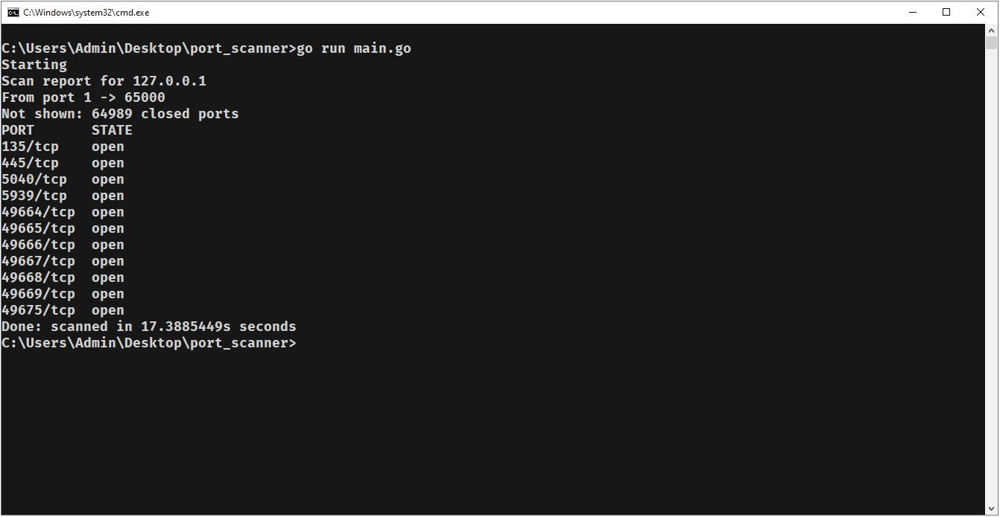
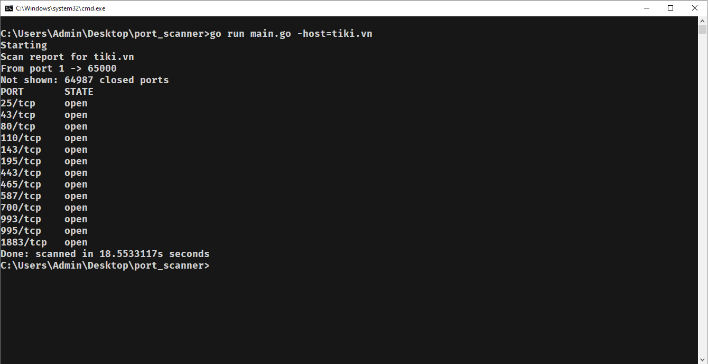
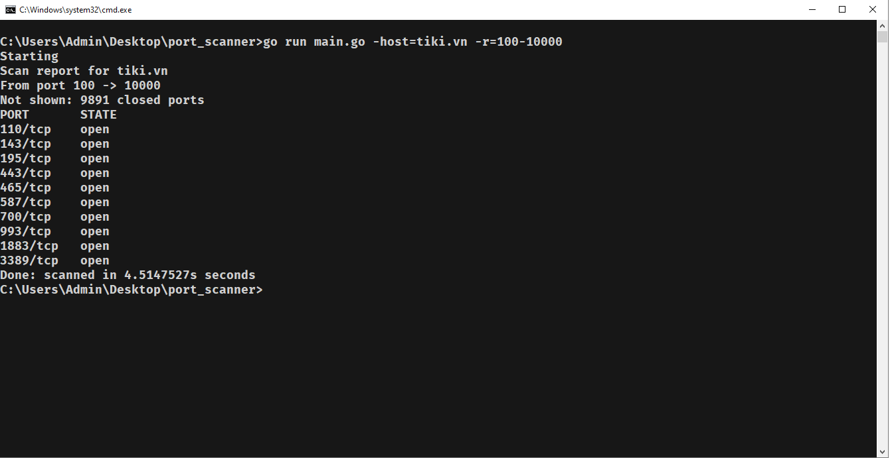
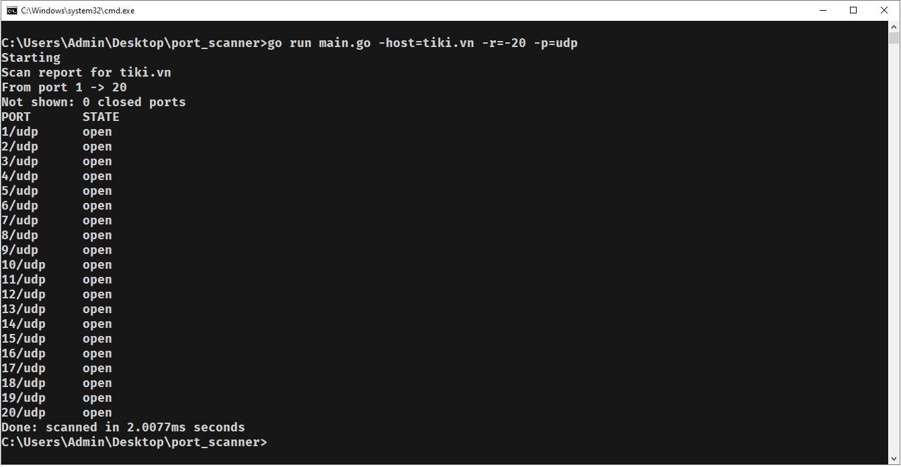

# Port Scanner
A Simple Port Scanner in Golang
## Usage
Run command
```
go run main.go -host=hostname -r=a-b -p=protocol
```
where `hostname` can be a domain name or ip address. The range `a-b` is the range that you long to scan.  
In default (case you didn't pass any argument), `hostname=127.0.0.1, r=1-65000, p=tcp`.  
The option range can be `a-b -> [a, b], a -> [a, 65000], -b -> [1, b]`.
## Demo
No argument passed

`hostname` passed

`hostname, r` passed

`hostname, r, p` passed

